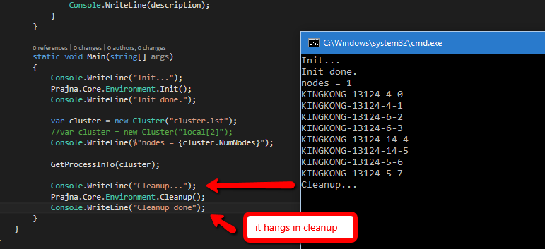

# PrajnaTest

This project shows an issue of Prajna that is built from source code.

- Clone Prajna master branch from [GitHub](https://github.com/MSRCCS/Prajna).
- Run `build.cmd R` to build it.
- Copy `${PrajnaDir}\bin\Release64\Client` to `${PrajnaTestDir}\Prajna\Client`.
- Copy `${PrajnaDir}\bin\Release64\CoreLib` to `${PrajnaTestDir}\Prajna\CoreLib`.
- Open this solution, build and run `PrajnaTest.CS`.

It will hang right after calling into `Cleanup()`. The screenshot is like:

